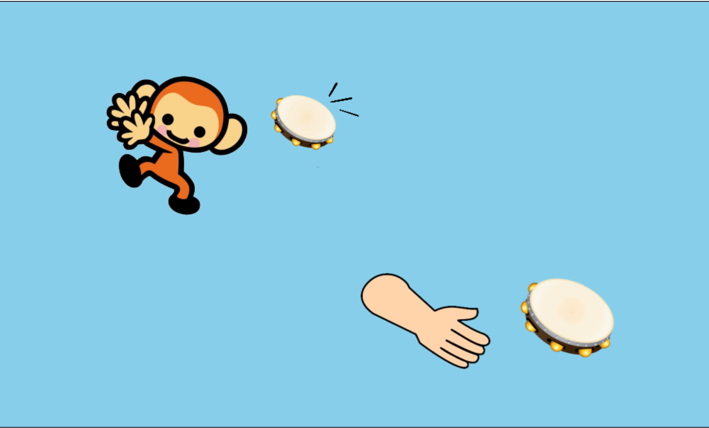

**PROJECT TITLE:** monkey-tambourine\
**PURPOSE OF PROJECT:** CS40S capstone project\
**VERSION or DATE:** May 2024\
**AUTHOR:** Holly Hong\
**USER INSTRUCTIONS:** requires greenfoot software\
**HOW TO PLAY:**\
Welcome to Monkey Tambourine!\
Each rhythm is one measure long, in 4/4 time. You get one empty measure on start, and then the monkey will play its first rhythm.\
After the monkey is finished, copy the rhythm back to the monkey as best you can! Press "e" to hit the tambourine, and "o" to shake.\
This repeats for 8 turns. Each rhythm is randomly generated.\
Your score will be shown at the end of the game. Have fun!

